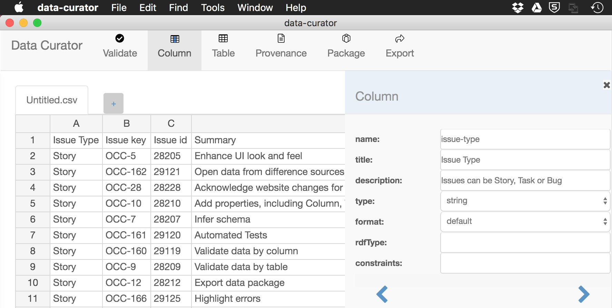

[![version][version-badge]][releases] 

 :sparkles: [Download Data Curator](https://github.com/ODIQueensland/data-curator/releases/latest) for Windows or macOS. :sparkles:
[Request a new feature](https://github.com/ODIQueensland/data-curator/issues/new?template=feature-request.md&labels=f:Feature-request&milestone=6&assignee=Stephen-Gates) :bulb: [Report a bug](https://github.com/ODIQueensland/data-curator/issues/new?template=bug.md&labels=problem:Bug&assignee=Stephen-Gates) :beetle: [View our plans](https://github.com/ODIQueensland/data-curator/milestones?direction=asc&sort=due_date&state=open) :rocket:

# Data Curator

Data Curator is a simple desktop CSV editor to help describe, validate and share usable open data.

## Why do we need Data Curator?

Open data creators are increasingly focusing on improving open data publishing so that data can be used to create insight and drive positive change.

Open data is more likely to be used if data consumers can:

- understand why and how the data was collected
- understand the structure of the data
- look up the meaning of codes used in the data
- understand the quality of the data
- access the data in an open machine-readable format
- know how the data is licensed and how it can be reused

## Features

Using Data Curator open data producers can:

- create and edit tabular data from scratch or from a template
- open data from a CSV or Microsoft Excel file
- open multiple related data tables from a [Data Package](http://frictionlessdata.io/data-packages/)
- automatically correct common problems found in CSV and Excel files

Using data from any of these sources, you can:

- automatically create a [schema](http://frictionlessdata.io/specs/table-schema/) that describes the data fields
- refine the schema to include extra [data validation rules](http://frictionlessdata.io/specs/table-schema/#constraints)
- validate the data against the schema
- describe the provenance of your data
- save data as a valid CSV file in various [CSV dialects](http://frictionlessdata.io/specs/csv-dialect/)

Once the data is described and validated, you can share the data and its description by exporting a [Data Package](http://frictionlessdata.io/data-packages/) to:

- publish the data on a CKAN open data portal
- use it as a template for others to make similar data

Open data consumers can use published Data Packages to:

- view the data structure and provenance information to help determine if the data is fit for their purpose
- download the data together with its metadata in a single zip file
- use [a suite of tools](http://frictionlessdata.io/tools/) to work with the data

## Follow our progress

Interested in this project? Subscribe to [Data Curator News](https://github.com/ODIQueensland/data-curator/issues/15) to get occasional updates on our progress and hear about [each release](https://github.com/ODIQueensland/data-curator/releases). [Ask a question](https://ask.theodi.org.au/c/projects/data-curator) on the forum.

## Contributions

We welcome all types of [contributions to Data Curator](https://github.com/ODIQueensland/data-curator/blob/master/.github/CONTRIBUTING.md):

- [financial](https://github.com/ODIQueensland/data-curator/blob/master/.github/CONTRIBUTING.md#contribute-financial-support)
- [ideas](https://github.com/ODIQueensland/data-curator/blob/master/.github/CONTRIBUTING.md#contribute-ideas-and-feature-requests)
- [issues](https://github.com/ODIQueensland/data-curator/blob/master/.github/CONTRIBUTING.md#contribute-issues)
- [documentation](https://github.com/ODIQueensland/data-curator/blob/master/.github/CONTRIBUTING.md#contribute-documentation)
- [code](https://github.com/ODIQueensland/data-curator/blob/master/.github/CONTRIBUTING.md#contribute-code)

We acknowledge the great work of others. We are:

- inspired by the [ODI](https://theodi.org) [Comma Chameleon](https://comma-chameleon.io/) experiment.
- using the [Open Knowledge International](https://okfn.org) Frictionless Data [specification](http://frictionlessdata.io) and [code libraries](http://frictionlessdata.io/tools/#javascript)
- adopting [W3C Data on the Web Best Practices](https://www.w3.org/TR/dwbp/#bp-summary)

Data Curator proudly [uses open source software](https://github.com/ODIQueensland/data-curator/network/dependencies), including:

  software                                                             | organisation                                                         | licence                                                                          | support                                                                        
  -------------------------------------------------------------------- | -------------------------------------------------------------------- | -------------------------------------------------------------------------------- | ------------------------------------------------------------------------------
  [Comma Chameleon](https://github.com/theodi/comma-chameleon)         | [The Open Data Institute](https://theodi.org)                        | [MIT](https://github.com/theodi/comma-chameleon/blob/master/LICENSE.md)          | [join](https://theodi.org/membership)                                          
  [datapackage.js](https://github.com/frictionlessdata/datapackage-js) | [Open Knowledge](https://okfn.org)                                   | [MIT](https://github.com/frictionlessdata/datapackage-js/blob/master/LICENSE.md) | [donate](https://okfn.org/donate/)                                             
  [tableschema-js](https://github.com/frictionlessdata/tableschema-js) | [Open Knowledge](https://okfn.org)                                   | [MIT](https://github.com/frictionlessdata/tableschema-js/blob/master/LICENSE.md) | [donate](https://okfn.org/donate/)                                             
  [Electron](https://electron.atom.io)                                 | [GitHub](https://github.com)                                         | [MIT](https://github.com/electron/electron/blob/master/LICENSE)                  | [contribute](https://github.com/electron/electron/blob/master/CONTRIBUTING.md)
  [Node.js](https://nodejs.org/en/download/)                           | [Node.js](https://nodejs.org/en/)                                    | [licence](https://raw.githubusercontent.com/nodejs/node/master/LICENSE)          | [contribute](https://nodejs.org/en/get-involved/)                              
  [Chromium](http://www.chromium.org/Home)                             | [The Chromium Authors](https://cs.chromium.org/chromium/src/AUTHORS) | [licence](https://cs.chromium.org/chromium/src/LICENSE)                          | [contribute](http://www.chromium.org/getting-involved)                         
  [Vue.js](https://vuejs.org)                                          | Yuxi (Evan) You                                                      | [MIT](https://github.com/vuejs/vue/blob/dev/LICENSE)                             | [donate](https://vuejs.org/support-vuejs/)                                     
  [electron-vue](https://github.com/SimulatedGREG/electron-vue)        | SimulatedGREG (Greg Holguin)                                         | [MIT](https://github.com/SimulatedGREG/electron-vue/blob/master/LICENSE.md)      | [contribute](https://simulatedgreg.gitbooks.io/electron-vue/content/en/contributing.html)
  [Handsontable](https://github.com/handsontable/handsontable)         | [Handsontable](https://handsontable.com)                             | [MIT](https://github.com/handsontable/handsontable/blob/master/LICENSE)          | [buy pro](https://handsontable.com/pricing.html)
  [Cucumber.js](https://github.com/cucumber/cucumber-js) | [Cucumber.io](https://cucumber.io) | [MIT](https://github.com/cucumber/cucumber-js/blob/master/LICENSE) | [contribute](https://opencollective.com/cucumber/donate?referral=5936)

## Download and Install Data Curator

- Choose a platform from the [Releases page](https://github.com/ODIQueensland/data-curator/releases/latest).
- Drag the application to your applications folder.

### On macOS

If you encounter [a warning message](https://github.com/ODIQueensland/data-curator/issues/111) informing you the application cannot be opened due to being from an unknown developer, try:

- Right click the app
- then option + click on Open.

This warning occurs due to macOS quarantining applications when it cannot determine the certificate used to sign the application. We're planning to sign the application so this goes away.

--------------------------------------------------------------------------------

## Development

We develop against the 'develop' branch. The 'master' branch contains tagged releases. We are currently using this [branching model](http://nvie.com/posts/a-successful-git-branching-model/) by Vincent Driessen.

### Requirements

`node` 
`yarn` 
`electron`

You can use [yarn](https://yarnpkg.com/en/) to install all relevant packages and development dependencies. ([Install yarn](https://yarnpkg.com/en/docs/install))

We're keeping our dependencies up to date with [Dependabot](https://dependabot.com).

### Running the application locally

To open the app on your local machine and run Data Curator in development mode:

- change to your local Data Curator directory
- `yarn` _(pulls down all dependencies)_
- `yarn run dev`

Data Curator will launch with an extra Developer menu.

### Application Architecture

Data Curator is built using [Electron](https://electron.atom.io), a framework that allows developers to build desktop applications using web technology.

There are two parts of the application, the main process and the renderer process. The main process deals with things like carrying out file operations, validating CSVs, and rendering views. The renderer acts very much like client side javascript in a web browser, dealing with things like presentation, and user interactions.

#### IPC messaging

Electron passes and listens for messages between main and renderer using the IPC module, one for the [main process](https://github.com/electron/electron/blob/master/docs/api/ipc-main.md) and one for the [renderer process](https://github.com/electron/electron/blob/master/docs/api/ipc-renderer.md).

## Coding Standards

We have adopted [Standard JS](https://standardjs.com) as our JavaScript coding standard.

## Tests

### Acceptance tests

Acceptance tests for [Data Curator](https://github.com/ODIQueensland/data-curator/blob/master/README.md) are:

- written using the [Gherkin language](https://cucumber.io/docs/reference#gherkin) ([learn more](https://media.pragprog.com/titles/hwcuc/gherkin.pdf)) and stored [on GitHub](https://github.com/ODIQueensland/data-curator/tree/master/test/features)
- [shared](https://app.cucumber.pro/projects/data-curator/documents/branch/develop) using the [Cucumber Pro](https://cucumber.io/pro) beta.
- arranged in folders like the application menu structure
- integrated with:

  - [Spectron](https://electron.atom.io/spectron/), a purpose built Electron testing framework
  - [Cucumber-js](https://github.com/cucumber/cucumber-js), a tool for running automated tests written in plain language for JavaScript
  - reporting tools:

    -  [nyc](https://github.com/istanbuljs/nyc), a tool for javascript test coverage
    -  [Cucumber-html-reporter](https://github.com/gkushang/cucumber-html-reporter), generates Cucumber HTML reports with pie charts
  - other common testing tools, such as
    - [Chai](http://chaijs.com)
    - [Spectron-fake-dialog](https://github.com/joe-re/spectron-fake-dialog)

Acceptance tests are automatically added to Cucumber Pro via a GitHub webhook.

### Unit tests

For unit testing, we use:
- [Karma](https://karma-runner.github.io/1.0/index.html), a browser test runner, designed for low-level/unit testing. Currently we use this for testing code running in electron's 'renderer' process.
- [Mocha](https://mochajs.org)
- [Chai](http://chaijs.com)
- [Sinon](http://sinonjs.org)
- [Mocha-webpack](https://github.com/zinserjan/mocha-webpack), a mocha test runner with integrated webpack precompiler. Currently we use this for testing code running in electron's 'main' process.

### Continuous integration

For continuous integration, we use:
- [Appveyor](https://www.appveyor.com)
- [Travis](https://travis-ci.org)

We plan to integrate the acceptance and unit tests with code commits

To run unit tests and implemented acceptance tests:

`yarn run test`

## Deployment

### Building a new package

To build Data Curator locally:

`yarn run build`

To automate deployment, we are using:

- [Appveyor](https://www.appveyor.com) for Windows deployment
- [Travis](https://travis-ci.org) for macOS and Linux

To trigger the automated build and draft release, create and push a git tag, following the versioning pattern used in current releases.
Ensure that any changes in this tag are also released back to develop and master branches.

Changes are recorded on the [Releases][releases] page.

[releases]: https://github.com/ODIQueensland/data-curator/releases
[version-badge]: https://img.shields.io/github/package-json/v/ODIQueensland/data-curator.svg
